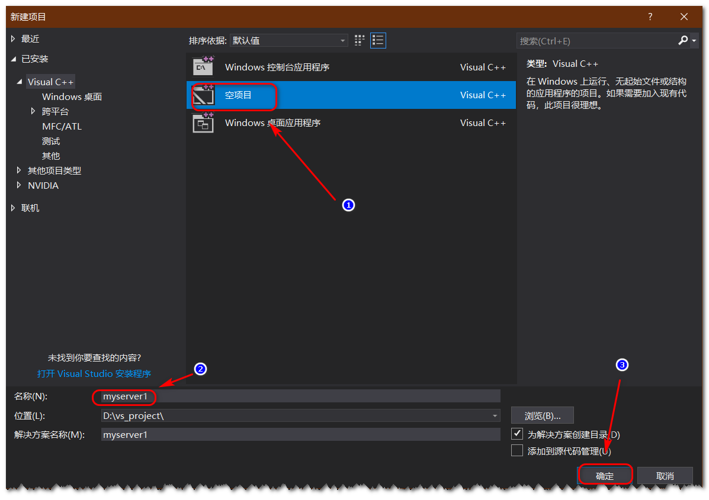
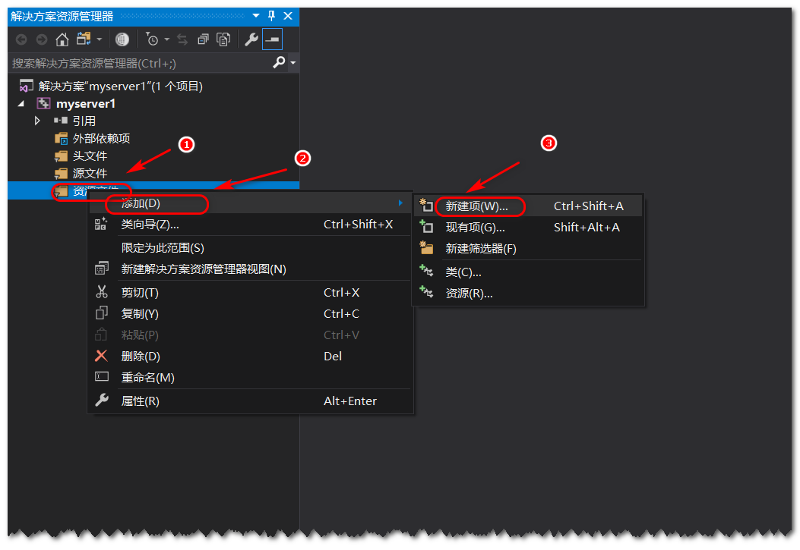
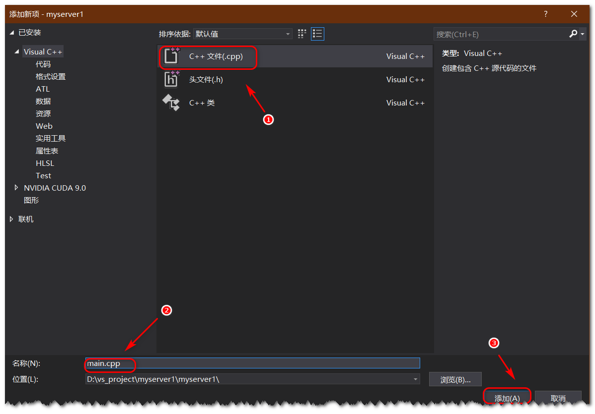
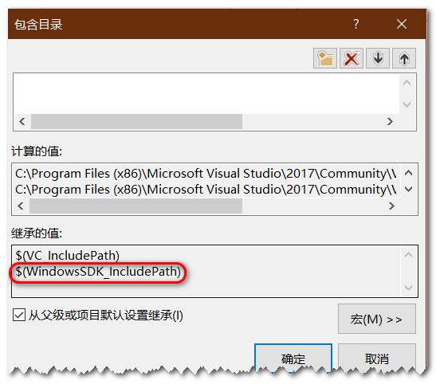
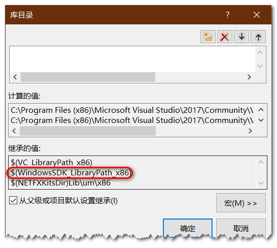
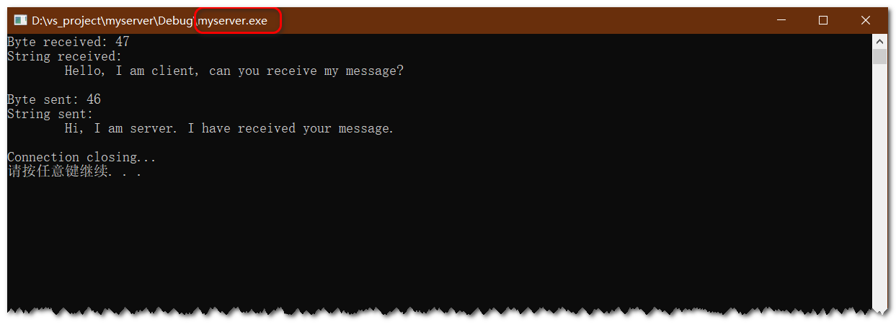
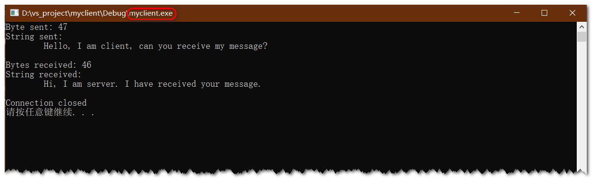

# 使用 winsock 实现简单的 Client 和 Server

本篇文章将介绍如何使用 winsock 来实现 Client 客户端 和 Server 服务器应用程序。由于 Client 和 Server 的具体实现有所不同，所以本文将分成两部分来对 Client 和 Server 的实现进行讲解。

## 运行环境

* Windows 10
* Visual Studio Community 2017 (version 15.9.17)

## Server 的实现

Server 的运行步骤如下：

1. 初始化 Winsock。(Initialize Winsock.)
2. 创建一个socket。(Create a socket.)
3. 绑定 socket。(Bind the socket.)
4. 监听客户端的 socket。(Listen on the socket for a client.)
5. 接受客户端的连接请求。(Accept a connection from a client.)
6. 接收和发送数据。(Receive and send data.)
7. 断开连接。(Disconnect.)

### 创建 Winsock 应用

打开 visual studio，创建一个空应用，并命名为 `myserver`。



然后新建一个空的 c++ 源文件，并命名为 `main.cpp`。





然后确认编译环境中的包含目录，库目录和源码路径中包含 Microsoft Windows Software Development Kit (SDK)。由于在安装 Visual Studio的时候，已经安装了 Microsoft Windows SDK，所以这些已经默认包含到了相应的环境中。不需要再自己添加。





确认依赖库文件 `Ws2_32.lib` 文件添加到依赖库中。在代码中可以使用 `#pragma comment(lib, "Ws2_32.lib")` 来进行链接。

要想使用相关的 Winsock 库的函数，需要导入相应的头文件。

`Winsock2.h` ：包含大部分 Winsock 函数、结构体和定义。
`Ws2tcpip.h` ：包含 WinSock 2 协议特定的 TCP/IP 附件文档中引入的定义，其中包括用于检索 IP 地址的较新函数和结构体。

```cpp
#include <winsock2.h>
#include <ws2tcpip.h>
#include <stdio.h>

#pragma comment(lib, "Ws2_32.lib")

int main() {
  return 0;
}
```

### 1. 初始化 Winsock

要使用 Winsock 相关的函数，必须先进行初始化。首先创建一个 `WSADATA` 对象。

```cpp
WSADATA wsaData;
```

调用 `WSAStartup()` 并进行错误检查。`MAKEWORD(2,2)` 表示 Winsock 版本为 2.2。

```cpp
int iResult;
iResult = WSAStartup(MAKEWORD(2, 2), &wsaData);
if (iResult != 0) {
    std::cout << "WSAStartup failed:" << iResult << std::endl;
    return 1;
}
```

### 2. 创建一个socket

初始化后，必须实例化 `SOCKET` 对象以供服务器使用。

这里会涉及到 `addrinfo` 结构体，这里将结构体源码拿出来看一下具体的结构。

```cpp
typedef struct addrinfo
{
    int                 ai_flags;       // AI_PASSIVE, AI_CANONNAME, AI_NUMERICHOST
    int                 ai_family;      // PF_xxx
    int                 ai_socktype;    // SOCK_xxx
    int                 ai_protocol;    // 0 or IPPROTO_xxx for IPv4 and IPv6
    size_t              ai_addrlen;     // Length of ai_addr
    char *              ai_canonname;   // Canonical name for nodename
    _Field_size_bytes_(ai_addrlen) struct sockaddr *   ai_addr;        // Binary address
    struct addrinfo *   ai_next;        // Next structure in linked list
}
```

`ai_family`： `AF_INET` 表示 Ipv4, `AF_INET6` 表示 Ipv6。
`ai_socktype`：`SOCK_STREAM` 表示 TCP 数据流传输方式, `SOCK_DGRAM` 表示 UDP 数据包传输方式。
`ai_protocol`: `IPPROTO_TCP` 表示 TCP 协议, `IPPROTO_UDP` 表示 UDP 协议。

关于各个参数的其他默认变量可以参考 [ADDRINFOA structure](https://docs.microsoft.com/zh-cn/windows/win32/api/ws2def/ns-ws2def-addrinfoa)

`addrinfo` 结构体可以作为 `getaddrinfo` 函数的参数使用，获取相关的信息。

```cpp
#define DEFAULT_PORT "27015"

struct addrinfo *result = NULL, *ptr = NULL, hints;

ZeroMemory(&hints, sizeof (hints));
hints.ai_family = AF_INET;
hints.ai_socktype = SOCK_STREAM;
hints.ai_protocol = IPPROTO_TCP;
hints.ai_flags = AI_PASSIVE;

// Resolve the local address and port to be used by the server
iResult = getaddrinfo(NULL, DEFAULT_PORT, &hints, &result);
if (iResult != 0) {
    std::cout << "getaddrinfo failed: " << iResult << std::endl;
    WSACleanup();
    return 1;
}
```

然后为服务器创建一个名为 `ListenSocket` 的 `SOCKET` 对象，以监听客户端连接。

```cpp
SOCKET ListenSocket = INVALID_SOCKET;
```

然后调用 `socket` 函数，将返回值赋给 `SOCKET` 对象并进行错误检查。

```cpp
// Create a SOCKET for the server to listen for client connections

ListenSocket = socket(result->ai_family, result->ai_socktype, result->ai_protocol);
if (ListenSocket == INVALID_SOCKET) {
    std::cout << "Error at socket(): " << WSAGetLastError() << std::endl;
    freeaddrinfo(result);
    WSACleanup();
    return 1;
}
```

### 3. 绑定 socket

为了使服务器接受客户端连接，必须将其绑定到系统内的网络地址。`sockaddr` 结构体保存地址族(address family)，IP 地址和端口号的信息。调用 `bind` 函数，将从 `getaddrinfo` 函数返回的创建的套接字和 `sockaddr` 结构体作为参数传递，并进行错误检查。

```cpp
iResult = bind(ListenSocket, result->ai_addr, (int)result->ai_addrlen);
if (iResult == SOCKET_ERROR) {
    std::cout << "bind failed with error: " << WSAGetLastError() << std::endl;
    freeaddrinfo(result);
    closesocket(ListenSocket);
    WSACleanup();
    return 1;
}
```

调用 `bind` 函数后，就不再需要由 `getaddrinfo` 函数返回的地址信息。调用 `freeaddrinfo` 函数可释放由 `getaddrinfo` 函数为此地址信息分配的内存。

```cpp
freeaddrinfo(result);
```

### 4. 监听客户端的 socket

调用 `listen` 函数并进行错误检查。

```cpp
if ( listen( ListenSocket, SOMAXCONN ) == SOCKET_ERROR ) {
    std::cout << "Listen failed: " << WSAGetLastError() << std::endl;
    closesocket(ListenSocket);
    WSACleanup();
    return 1;
}
```

### 5. 接受客户端的连接请求

创建一个名为 `ClientSocket` 的临时 `SOCKET` 对象，以接受来自客户端的连接。通常，服务器应用程序将被设计为监听来自多个客户端的连接。对于高性能服务器，通常使用多个线程来处理多个客户端连接。本实例中并没有考虑多个客户端请求。对于多客户端的解决方法可以参考 [Accepting a Connection](https://docs.microsoft.com/en-us/windows/win32/winsock/accepting-a-connection)

```cpp
SOCKET ClientSocket;

ClientSocket = INVALID_SOCKET;

// Accept a client socket
ClientSocket = accept(ListenSocket, NULL, NULL);
if (ClientSocket == INVALID_SOCKET) {
    std::cout << "accept failed: " << WSAGetLastError() << std::endl;
    closesocket(ListenSocket);
    WSACleanup();
    return 1;
}
```

### 6. 接收和发送数据

通过调用 `send` 和 `recv` 函数可以进行数据的发送和接收。

```cpp
#define DEFAULT_BUFLEN 512

char recvbuf[DEFAULT_BUFLEN];
int iResult, iSendResult;
int recvbuflen = DEFAULT_BUFLEN;

// Receive until the peer shuts down the connection
do {

    iResult = recv(ClientSocket, recvbuf, recvbuflen, 0);
    if (iResult > 0) {
        std::cout << "Byte received: " << iResult << std::endl;

        // Echo the buffer back to the sender
        iSendResult = send(ClientSocket, recvbuf, iResult, 0);
        if (iSendResult == SOCKET_ERROR) {
            printf("send failed: %d\n", WSAGetLastError());
            closesocket(ClientSocket);
            WSACleanup();
            return 1;
        }
        std::cout << "Byte sent: " << iSendResult << std::endl;
    } else if (iResult == 0)
        std::cout << "\nConnection closing..." << std::endl;
    else {
        std::cout << "recv failed: " << WSAGetLastError() << std::endl;
        closesocket(ClientSocket);
        WSACleanup();
        return 1;
    }

} while (iResult > 0);
```

7. 断开连接。(Disconnect.)

服务器完成从客户端接收数据并将数据发送回客户端后，服务器将与客户端断开连接并关闭套接字。断开连接调用 `shutdown` 函数，关闭套接字调用 `closesocket` 函数。

```cpp
// shutdown the send half of the connection since no more data will be sent
iResult = shutdown(ClientSocket, SD_SEND);
if (iResult == SOCKET_ERROR) {
    std::cout << "shutdown failed:" << WSAGetLastError() << std::endl;
    closesocket(ClientSocket);
    WSACleanup();
    return 1;
}

// cleanup
closesocket(ClientSocket);
WSACleanup();

return 0;
```

## Client 的实现

Client 的运行步骤如下：

1. 初始化 Winsock。(Initialize Winsock.)
2. 创建一个socket。(Create a socket.)
3. 连接到服务器。(Connect to the server.)
4. 发送和接收数据。(Send and receive data.)
5. 断开连接。(Disconnect.)

要实现 Client 需要重新创建一个应用程序，创建过程和服务器程序的创建过程相同，并且前两步都是相同的，但还是由点点区别，这里将只对不同的地方进行说明。具体的请参考文末的源代码链接。

### 初始化 Winsock

客户端要连接到服务器需要指定服务器的主机地址，因此在主函数中需要传递该参数。所以需要添加以下代码判断。

```cpp
if (argc != 2) {
    std::cout << "usage: " << argv[0] << "server-name" << std::endl;
    system("pause");
    return 1;
}
```

然后进行初始化

```cpp
// 1. Initialize Winsock
WSADATA wsaData;
int iResult;
iResult = WSAStartup(MAKEWORD(2, 2), &wsaData);
if (iResult != 0) {
    std::cout << "WSAStartup failed: " << iResult << std::endl;
    system("pause");
    return 1;
}
```

### 创建一个socket & 连接到服务器

创建 socket 和连接与服务器相同，但是由于连接可能失败，因此这里需要使用循环来进行连接 `getaddrinfo` 返回的不同的结果，直到连接成功。

```cpp
// 2. Create a socket
struct addrinfo *result = NULL, *ptr = NULL, hints;
ZeroMemory(&hints, sizeof(hints));
hints.ai_family = AF_UNSPEC;
hints.ai_socktype = SOCK_STREAM;
hints.ai_protocol = IPPROTO_TCP;

iResult = getaddrinfo(argv[1], DEFAULT_PORT, &hints, &result);
if (iResult != 0) {
    std::cout << "getaddrinfo failed: " << iResult << std::endl;
    WSACleanup();
    system("pause");
    return 1;
}

SOCKET ConnectSocket = INVALID_SOCKET;

// Attempt to connect to an address until one succeeds
for (ptr = result; ptr != NULL; ptr = ptr->ai_next) {

    /* Create a SOCKET for connecting to server*/
    ConnectSocket = socket(ptr->ai_family, ptr->ai_socktype, ptr->ai_protocol);
    if (ConnectSocket == INVALID_SOCKET) {
        std::cout << "Error at socket(): " << WSAGetLastError() << std::endl;
        freeaddrinfo(result);
        WSACleanup();
        system("pause");
        return 1;
    }

    // 3. Connect to the server
    iResult = connect(ConnectSocket, ptr->ai_addr, (int)ptr->ai_addrlen);
    if (iResult == SOCKET_ERROR) {
        closesocket(ConnectSocket);
        ConnectSocket = INVALID_SOCKET;
        continue;
    }
    break;
}

freeaddrinfo(result);

if (ConnectSocket == INVALID_SOCKET) {
    std::cout << "Unable to connect to server!" << std::endl;
    WSACleanup();
    system("pause");
    return 1;
}
```

### 4. 发送和接收数据

连接建立后，客户端首先是发送数据给客户端。

```cpp
int recvbuflen = DEFAULT_BUFLEN;

const char *sendbuf = "Hello, I am client, can you receive my message?";
char recvbuf[DEFAULT_BUFLEN];

iResult = send(ConnectSocket, sendbuf, (int)strlen(sendbuf), 0);
if (iResult == SOCKET_ERROR) {
    std::cout << "send failed: " << WSAGetLastError() << std::endl;
    closesocket(ConnectSocket);
    WSACleanup();
    system("pause");
    return 1;
}

std::cout << "Byte sent: " << iResult << std::endl;
std::cout << "String sent:\n\t" << sendbuf << std::endl;
```

当客户端发送完数据之后，将断开发送的连接

```cpp
// shutdown the send half of the connection since no more data will be sent
iResult = shutdown(ConnectSocket, SD_SEND);
if (iResult == SOCKET_ERROR) {
    std::cout << "shutdown failed: " << WSAGetLastError() << std::endl;
    closesocket(ConnectSocket);
    WSACleanup();
    system("pause");
    return 1;
}
```

虽然断开了，但是客户端还可以接收服务器发来的数据。

```cpp
do {
    iResult = recv(ConnectSocket, recvbuf, recvbuflen, 0);
    if (iResult > 0) {
        std::cout << "\nBytes received: " << iResult << std::endl;
        std::cout << "String received:\n\t" << std::string(recvbuf, 0, iResult) << std::endl;
    }
    else if (iResult == 0)
        std::cout << "\nConnection closed" << std::endl;
    else
    {
        std::cout << "recv failed: " << WSAGetLastError() << std::endl;
    }
} while (iResult > 0);
```

### 5. 断开连接

当服务器发送完了数据并断开连接后，客户端也需要断开连接，并关闭套接字。

```cpp
closesocket(ConnectSocket);
WSACleanup();
```

## 最终代码以及运行效果

源代码地址：[]()

运行结果：





## 参考链接

- [Windows Sockets 2](https://docs.microsoft.com/en-us/windows/win32/winsock/windows-sockets-start-page-2)
- [Sloan Kelly
 YouTube Source Repository](https://bitbucket.org/sloankelly/youtube-source-repository/src/master/cpp/networking/)